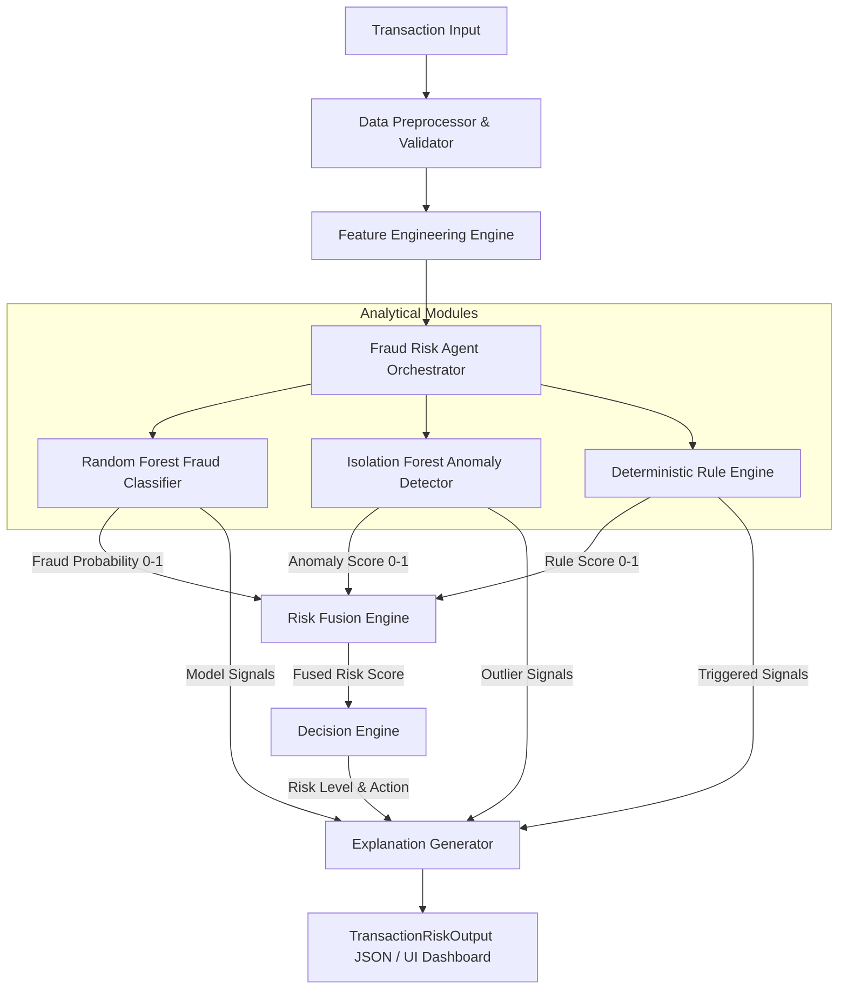
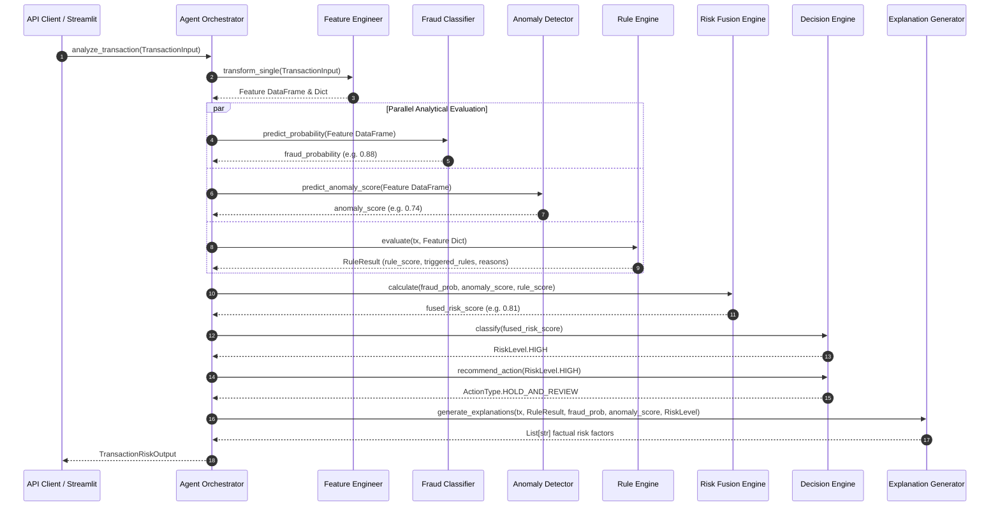

# System Architecture & Technical Specifications

## 1. High-Level Architecture Overview

The **Fraud Detection & Transaction Risk Agent** is a multi-signal risk evaluation system designed to assess individual financial transactions in real time. Rather than relying on a single heuristic or a fragile black-box model, the system fuses **supervised machine learning**, **unsupervised anomaly detection**, and **deterministic business rules** into a single calibrated risk score, a categorical risk tier, an actionable policy recommendation, and factual, evidence-based explanations.



---

## 2. Component Responsibilities

| Component | Module | Responsibility |
| :--- | :--- | :--- |
| **Pydantic Schemas** | `src/schemas/transaction.py` | Strict validation of incoming financial events and typed output contracts. |
| **Data & Preprocessing** | `src/data/` | Type conversions, missing value imputation with deterministic baselines, payload validation. |
| **Feature Engineer** | `src/features/feature_engineering.py` | Transforms transaction fields into a fixed 14-dimensional feature vector. |
| **Fraud Classifier** | `src/models/fraud_classifier.py` | Supervised `RandomForestClassifier` outputting calibrated fraud probability $P(\text{fraud}) \in [0, 1]$. |
| **Anomaly Detector** | `src/models/anomaly_detector.py` | Unsupervised `IsolationForest` identifying multi-dimensional outliers, normalized to $[0, 1]$. |
| **Rule Engine** | `src/rules/rule_engine.py` | Deterministic expert rules evaluating deviation, unknown devices/merchants, and velocity signals. |
| **Risk Fusion Engine** | `src/risk/risk_fusion.py` | Weighted fusion: $0.60 \times P(\text{fraud}) + 0.25 \times \text{anomaly} + 0.15 \times \text{rule}$. |
| **Decision Engine** | `src/risk/decision_engine.py` | Threshold mapping to `LOW`, `MEDIUM`, `HIGH`, `CRITICAL` and actionable mitigation policies. |
| **Explanation Generator**| `src/agent/explanation.py` | Evidence-grounded natural language explanation list without LLM hallucination. |
| **Agent Orchestrator** | `src/agent/orchestrator.py` | End-to-end execution coordinator exposing `analyze_transaction()`. |
| **FastAPI Service** | `api/main.py` | High-throughput async REST endpoints (`/api/v1/analyze`, `/health`, `/api/v1/scenarios`). |
| **Streamlit Dashboard** | `app/streamlit_app.py` | Interactive dashboard for scenario demonstration and manual risk review. |

---

## 3. Data Flow & Execution Pipeline



---

## 4. Analytical Modules & Calibrations

### 4.1 Feature Engineering Schema
The feature engineering module generates 14 deterministic features:
1. `amount`: Raw monetary amount.
2. `amount_deviation`: Relative deviation $\frac{\text{amount} - \overline{\text{avg}}}{\max(\overline{\text{avg}}, 1.0)}$.
3. `amount_to_avg_ratio`: Multiplier $\frac{\text{amount}}{\max(\overline{\text{avg}}, 1.0)}$.
4. `transaction_velocity`: Total transaction count in past 24 hours.
5. `new_device_indicator`: Binary flag ($1.0$ if device unrecognized).
6. `new_merchant_indicator`: Binary flag ($1.0$ if merchant unrecognized).
7. `unusual_time_indicator`: Binary flag ($1.0$ if between 00:00 and 05:59).
8. `location_deviation_indicator`: Binary flag ($1.0$ if location inconsistent).
9. `failed_attempts`: Count of recent authorization failures.
10. `account_age_days`: Age of account in days.
11. `previous_transaction_count`: Historical transaction count.
12. `previous_average_amount`: Historical average transaction amount.
13. `hour_of_day`: Integer hour ($0-23$).
14. `day_of_week`: Integer day of week ($0-6$).

### 4.2 Deterministic Rules Matrix
| Rule ID | Trigger Condition | Weight | Rationale |
| :--- | :--- | :--- | :--- |
| `HIGH_AMOUNT_DEVIATION` | $\text{amount} > 3.0 \times \overline{\text{avg}}$ (or $\ge \$1,000$ without history) | 0.25 | Significant capital outflow deviation. |
| `NEW_DEVICE` | `previous_device_known == False` | 0.15 | Unrecognized hardware fingerprint. |
| `UNUSUAL_TIME` | `hour in [0, 1, 2, 3, 4, 5]` | 0.10 | Off-peak nocturnal fraud window. |
| `HIGH_TRANSACTION_VELOCITY` | `transactions_last_24h >= 5` | 0.20 | Rapid card-testing / account draining. |
| `NEW_MERCHANT` | `previous_merchant_known == False` | 0.10 | First-time recipient exposure. |
| `LOCATION_DEVIATION` | `is_location_consistent == False` | 0.10 | Geographic / IP proxy inconsistency. |
| `MULTIPLE_FAILED_ATTEMPTS` | `failed_attempts >= 3` | 0.10 | Brute force or credential stuffing indicator. |

---

## 5. Risk Fusion & Policy Mapping

### 5.1 Fused Score Formula
$$\text{Risk Score} = \text{clamp}_{[0, 1]}\left(w_{\text{fraud}} \cdot P(\text{fraud}) + w_{\text{anomaly}} \cdot S_{\text{anomaly}} + w_{\text{rule}} \cdot S_{\text{rule}}\right)$$

Default Weights (configured in `config/config.yaml`):
- $w_{\text{fraud}} = 0.60$
- $w_{\text{anomaly}} = 0.25$
- $w_{\text{rule}} = 0.15$

### 5.2 Decision Engine Policy Matrix
| Risk Score Range | Risk Level | Policy Action | Operational Handling |
| :--- | :--- | :--- | :--- |
| $[0.00, 0.30)$ | `LOW` | `APPROVE` | Frictionless instant processing. |
| $[0.30, 0.70)$ | `MEDIUM` | `ADDITIONAL_VERIFICATION` | Step-up authentication (SMS/2FA, biometric). |
| $[0.70, 0.90)$ | `HIGH` | `HOLD_AND_REVIEW` | Temporary hold routed to manual analyst queue. |
| $[0.90, 1.00]$ | `CRITICAL` | `BLOCK_AND_INVESTIGATE` | Immediate rejection & security alert created. |

---

## 6. API Contracts

### `POST /api/v1/analyze`
**Request Payload (`TransactionInput`):**
```json
{
  "transaction_id": "TX_9901",
  "user_id": "USR_101",
  "amount": 1250.00,
  "transaction_type": "PURCHASE",
  "timestamp": "2026-09-15T03:15:00",
  "merchant_id": "MERCH_ELECTRONICS",
  "device_id": "DEV_NEW_9",
  "location": "Chicago, US",
  "account_age_days": 180,
  "previous_transaction_count": 40,
  "previous_average_amount": 95.00,
  "failed_attempts": 1,
  "previous_device_known": false,
  "previous_merchant_known": false,
  "transactions_last_24h": 3,
  "is_location_consistent": true
}
```

**Response Payload (`TransactionRiskOutput`):**
```json
{
  "transaction_id": "TX_9901",
  "fraud_probability": 0.6821,
  "anomaly_score": 0.5410,
  "rule_score": 0.5000,
  "risk_score": 0.6195,
  "risk_level": "MEDIUM",
  "risk_factors": [
    "Transaction amount ($1,250.00) is significantly above historical average ($95.00).",
    "New device detected.",
    "Transaction occurred during an unusual time (03:00).",
    "New merchant detected.",
    "Supervised fraud model detected high-risk behavioral pattern (estimated probability: 68.2%).",
    "Unsupervised anomaly detector flagged minor deviation from baseline norms (anomaly score: 54.1%)."
  ],
  "recommended_action": "ADDITIONAL_VERIFICATION"
}
```

---

## 7. Future Extension Points (Phase 2+)

1. **Real-time Feature Store Integration**: Connect to Redis / Feast for automated real-time feature retrieval (e.g. rolling 1-hour transaction velocities).
2. **Graph Risk Signals**: Incorporate identity clustering & money mule network detection via Neo4j / NetworkX.
3. **Model Retraining Pipeline**: Scheduled drift detection, shadow model deployment, and continuous learning on verified fraud chargeback labels.
4. **LLM Executive Summary Agent**: Optional LLM layer to produce executive analyst case briefings on `CRITICAL` tier events.
